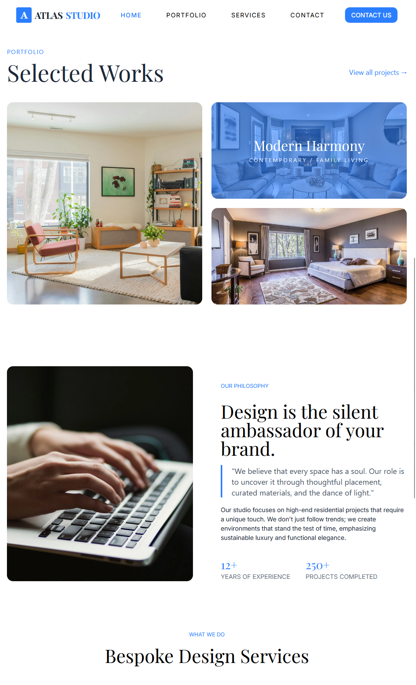

# 🎨 Atlas Studios — Landing Page de Design de Interiores

**Atlas Studios** é uma **landing page profissional para um estúdio de design de interiores**, desenvolvida para apresentar projetos, serviços e diferenciais da marca de forma elegante, moderna e focada em conversão.

O projeto foi construído com foco em **experiência visual refinada**, **componentização escalável**, utilizando uma stack moderna baseada em **React + Vite + TypeScript**, com estilização via **TailwindCSS** e variantes de componentes com **CVA (Class Variance Authority)**.

---

## ⚙️ Tecnologias Utilizadas

O projeto foi desenvolvido utilizando uma stack front-end moderna:

### Front-end
- **React** — Construção da interface
- **Vite** — Ambiente de desenvolvimento rápido e build otimizado
- **TypeScript** — Tipagem estática para maior segurança
- **TailwindCSS** — Estilização utilitária e responsiva
- **CVA (Class Variance Authority)** — Gerenciamento de variantes de componentes

---

## 🎯 Objetivos do Projeto

- Criar uma **landing page sofisticada para design de interiores**
- Transmitir **autoridade, estética e profissionalismo**
- Garantir **boa experiência em dispositivos móveis**
- Estruturar componentes de forma escalável e reutilizável
- Consolidar um template moderno para futuros projetos institucionais

---

## 🖥️ Preview

